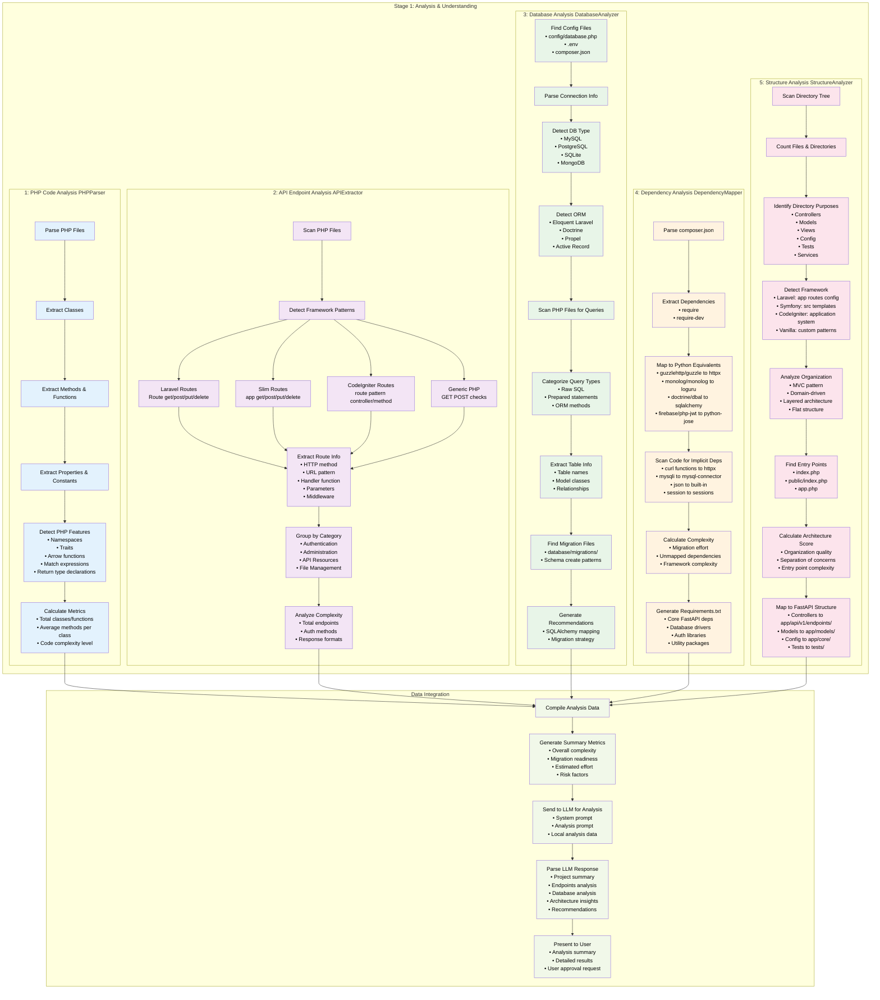

```mermaid
graph TB
    subgraph "Stage 1: Analysis & Understanding"
        direction TB

        subgraph "1: PHP Code Analysis PHPParser"
            P1["Parse PHP Files"] --> P2["Extract Classes"]
            P2 --> P3["Extract Methods & Functions"]
            P3 --> P4["Extract Properties & Constants"]
            P4 --> P5["Detect PHP Features<br/>• Namespaces<br/>• Traits<br/>• Arrow functions<br/>• Match expressions<br/>• Return type declarations"]
            P5 --> P6["Calculate Metrics<br/>• Total classes/functions<br/>• Average methods per class<br/>• Code complexity level"]
        end

        subgraph "2: API Endpoint Analysis APIExtractor"
            A1["Scan PHP Files"] --> A2["Detect Framework Patterns"]
            A2 --> A3["Laravel Routes<br/>Route get/post/put/delete"]
            A2 --> A4["Slim Routes<br/>app get/post/put/delete"]
            A2 --> A5["CodeIgniter Routes<br/>route pattern controller/method"]
            A2 --> A6["Generic PHP<br/>GET POST checks"]
            A3 --> A7["Extract Route Info<br/>• HTTP method<br/>• URL pattern<br/>• Handler function<br/>• Parameters<br/>• Middleware"]
            A4 --> A7
            A5 --> A7
            A6 --> A7
            A7 --> A8["Group by Category<br/>• Authentication<br/>• Administration<br/>• API Resources<br/>• File Management"]
            A8 --> A9["Analyze Complexity<br/>• Total endpoints<br/>• Auth methods<br/>• Response formats"]
        end

        subgraph "3: Database Analysis DatabaseAnalyzer"
            D1["Find Config Files<br/>• config/database.php<br/>• .env<br/>• composer.json"] --> D2["Parse Connection Info"]
            D2 --> D3["Detect DB Type<br/>• MySQL<br/>• PostgreSQL<br/>• SQLite<br/>• MongoDB"]
            D3 --> D4["Detect ORM<br/>• Eloquent Laravel<br/>• Doctrine<br/>• Propel<br/>• Active Record"]
            D4 --> D5["Scan PHP Files for Queries"]
            D5 --> D6["Categorize Query Types<br/>• Raw SQL<br/>• Prepared statements<br/>• ORM methods"]
            D6 --> D7["Extract Table Info<br/>• Table names<br/>• Model classes<br/>• Relationships"]
            D7 --> D8["Find Migration Files<br/>• database/migrations/<br/>• Schema create patterns"]
            D8 --> D9["Generate Recommendations<br/>• SQLAlchemy mapping<br/>• Migration strategy"]
        end

        subgraph "4: Dependency Analysis DependencyMapper"
            DP1["Parse composer.json"] --> DP2["Extract Dependencies<br/>• require<br/>• require-dev"]
            DP2 --> DP3["Map to Python Equivalents<br/>• guzzlehttp/guzzle to httpx<br/>• monolog/monolog to loguru<br/>• doctrine/dbal to sqlalchemy<br/>• firebase/php-jwt to python-jose"]
            DP3 --> DP4["Scan Code for Implicit Deps<br/>• curl functions to httpx<br/>• mysqli to mysql-connector<br/>• json to built-in<br/>• session to sessions"]
            DP4 --> DP5["Calculate Complexity<br/>• Migration effort<br/>• Unmapped dependencies<br/>• Framework complexity"]
            DP5 --> DP6["Generate Requirements.txt<br/>• Core FastAPI deps<br/>• Database drivers<br/>• Auth libraries<br/>• Utility packages"]
        end

        subgraph "5: Structure Analysis StructureAnalyzer"
            S1["Scan Directory Tree"] --> S2["Count Files & Directories"]
            S2 --> S3["Identify Directory Purposes<br/>• Controllers<br/>• Models<br/>• Views<br/>• Config<br/>• Tests<br/>• Services"]
            S3 --> S4["Detect Framework<br/>• Laravel: app routes config<br/>• Symfony: src templates<br/>• CodeIgniter: application system<br/>• Vanilla: custom patterns"]
            S4 --> S5["Analyze Organization<br/>• MVC pattern<br/>• Domain-driven<br/>• Layered architecture<br/>• Flat structure"]
            S5 --> S6["Find Entry Points<br/>• index.php<br/>• public/index.php<br/>• app.php"]
            S6 --> S7["Calculate Architecture Score<br/>• Organization quality<br/>• Separation of concerns<br/>• Entry point complexity"]
            S7 --> S8["Map to FastAPI Structure<br/>• Controllers to app/api/v1/endpoints/<br/>• Models to app/models/<br/>• Config to app/core/<br/>• Tests to tests/"]
        end
    end

    subgraph "Data Integration"
        INT1["Compile Analysis Data"] --> INT2["Generate Summary Metrics<br/>• Overall complexity<br/>• Migration readiness<br/>• Estimated effort<br/>• Risk factors"]
        INT2 --> INT3["Send to LLM for Analysis<br/>• System prompt<br/>• Analysis prompt<br/>• Local analysis data"]
        INT3 --> INT4["Parse LLM Response<br/>• Project summary<br/>• Endpoints analysis<br/>• Database analysis<br/>• Architecture insights<br/>• Recommendations"]
        INT4 --> INT5["Present to User<br/>• Analysis summary<br/>• Detailed results<br/>• User approval request"]
    end

    %% Connect the main flows
    P6 --> INT1
    A9 --> INT1
    D9 --> INT1
    DP6 --> INT1
    S8 --> INT1

    %% Styling
    classDef parser fill:#e3f2fd,color:#000
    classDef api fill:#f3e5f5,color:#000
    classDef database fill:#e8f5e8,color:#000
    classDef dependency fill:#fff3e0,color:#000
    classDef structure fill:#fce4ec,color:#000
    classDef integration fill:#f1f8e9,color:#000

    class P1,P2,P3,P4,P5,P6 parser
    class A1,A2,A3,A4,A5,A6,A7,A8,A9 api
    class D1,D2,D3,D4,D5,D6,D7,D8,D9 database
    class DP1,DP2,DP3,DP4,DP5,DP6 dependency
    class S1,S2,S3,S4,S5,S6,S7,S8 structure
    class INT1,INT2,INT3,INT4,INT5 integration
```
