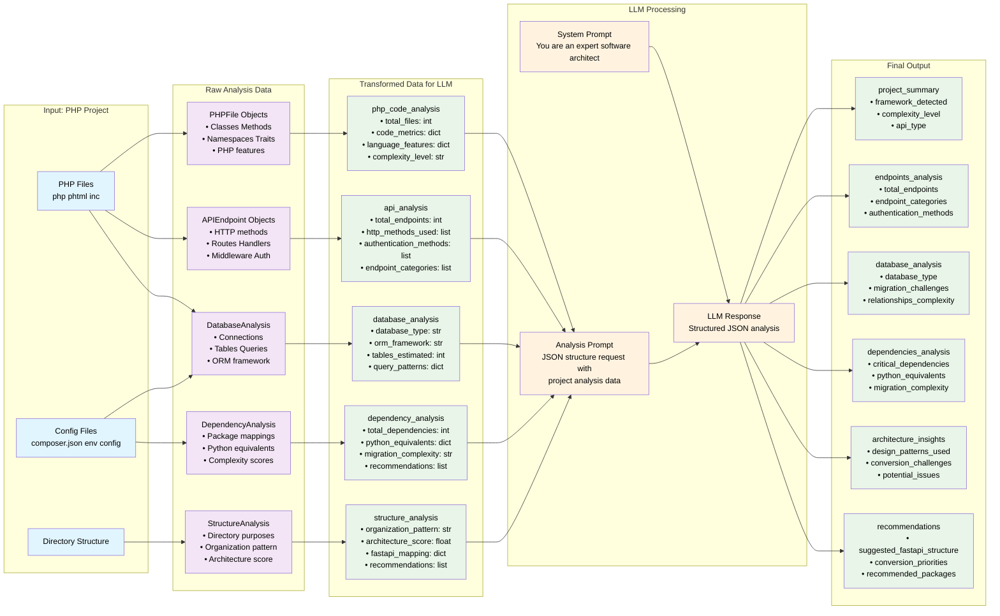

```mermaid
graph LR
    subgraph "Input: PHP Project"
        I1["PHP Files<br/>php phtml inc"]
        I2["Config Files<br/>composer.json env config"]
        I3["Directory Structure"]
    end

    subgraph "Raw Analysis Data"
        R1["PHPFile Objects<br/>• Classes Methods<br/>• Namespaces Traits<br/>• PHP features"]
        R2["APIEndpoint Objects<br/>• HTTP methods<br/>• Routes Handlers<br/>• Middleware Auth"]
        R3["DatabaseAnalysis<br/>• Connections<br/>• Tables Queries<br/>• ORM framework"]
        R4["DependencyAnalysis<br/>• Package mappings<br/>• Python equivalents<br/>• Complexity scores"]
        R5["StructureAnalysis<br/>• Directory purposes<br/>• Organization pattern<br/>• Architecture score"]
    end

    subgraph "Transformed Data for LLM"
        T1["php_code_analysis<br/>• total_files: int<br/>• code_metrics: dict<br/>• language_features: dict<br/>• complexity_level: str"]
        T2["api_analysis<br/>• total_endpoints: int<br/>• http_methods_used: list<br/>• authentication_methods: list<br/>• endpoint_categories: list"]
        T3["database_analysis<br/>• database_type: str<br/>• orm_framework: str<br/>• tables_estimated: int<br/>• query_patterns: dict"]
        T4["dependency_analysis<br/>• total_dependencies: int<br/>• python_equivalents: dict<br/>• migration_complexity: str<br/>• recommendations: list"]
        T5["structure_analysis<br/>• organization_pattern: str<br/>• architecture_score: float<br/>• fastapi_mapping: dict<br/>• recommendations: list"]
    end

    subgraph "LLM Processing"
        L1["System Prompt<br/>You are an expert software architect"]
        L2["Analysis Prompt<br/>JSON structure request with<br/>project analysis data"]
        L3["LLM Response<br/>Structured JSON analysis"]
    end

    subgraph "Final Output"
        O1["project_summary<br/>• framework_detected<br/>• complexity_level<br/>• api_type"]
        O2["endpoints_analysis<br/>• total_endpoints<br/>• endpoint_categories<br/>• authentication_methods"]
        O3["database_analysis<br/>• database_type<br/>• migration_challenges<br/>• relationships_complexity"]
        O4["dependencies_analysis<br/>• critical_dependencies<br/>• python_equivalents<br/>• migration_complexity"]
        O5["architecture_insights<br/>• design_patterns_used<br/>• conversion_challenges<br/>• potential_issues"]
        O6["recommendations<br/>• suggested_fastapi_structure<br/>• conversion_priorities<br/>• recommended_packages"]
    end

    %% Data Flow Connections
    I1 --> R1
    I1 --> R2
    I1 --> R3
    I2 --> R3
    I2 --> R4
    I3 --> R5

    R1 --> T1
    R2 --> T2
    R3 --> T3
    R4 --> T4
    R5 --> T5

    T1 --> L2
    T2 --> L2
    T3 --> L2
    T4 --> L2
    T5 --> L2
    L1 --> L3
    L2 --> L3

    L3 --> O1
    L3 --> O2
    L3 --> O3
    L3 --> O4
    L3 --> O5
    L3 --> O6

    %% Styling
    classDef input fill:#e1f5fe,color:#000
    classDef raw fill:#f3e5f5,color:#000
    classDef transformed fill:#e8f5e8,color:#000
    classDef llm fill:#fff3e0,color:#000
    classDef output fill:#e8f5e8,color:#000

    class I1,I2,I3 input
    class R1,R2,R3,R4,R5 raw
    class T1,T2,T3,T4,T5 transformed
    class L1,L2,L3 llm
    class O1,O2,O3,O4,O5,O6 output
```
