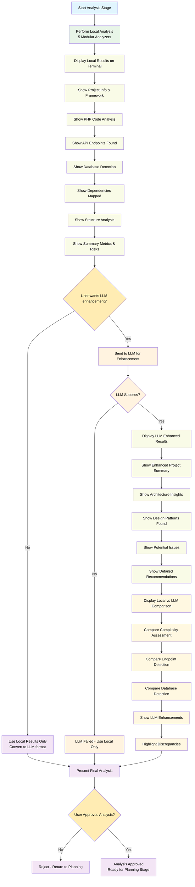

```mermaid
flowchart TD
    A["Start Analysis Stage"] --> B["Perform Local Analysis<br/>5 Modular Analyzers"]

    B --> C["Display Local Results on Terminal"]
    C --> C1["Show Project Info & Framework"]
    C1 --> C2["Show PHP Code Analysis"]
    C2 --> C3["Show API Endpoints Found"]
    C3 --> C4["Show Database Detection"]
    C4 --> C5["Show Dependencies Mapped"]
    C5 --> C6["Show Structure Analysis"]
    C6 --> C7["Show Summary Metrics & Risks"]

    C7 --> D{User wants LLM enhancement?}
    D -->|No| E["Use Local Results Only<br/>Convert to LLM format"]
    D -->|Yes| F["Send to LLM for Enhancement"]

    F --> G{LLM Success?}
    G -->|No| H["LLM Failed - Use Local Only"]
    G -->|Yes| I["Display LLM Enhanced Results"]

    I --> I1["Show Enhanced Project Summary"]
    I1 --> I2["Show Architecture Insights"]
    I2 --> I3["Show Design Patterns Found"]
    I3 --> I4["Show Potential Issues"]
    I4 --> I5["Show Detailed Recommendations"]

    I5 --> J["Display Local vs LLM Comparison"]
    J --> J1["Compare Complexity Assessment"]
    J1 --> J2["Compare Endpoint Detection"]
    J2 --> J3["Compare Database Detection"]
    J3 --> J4["Show LLM Enhancements"]
    J4 --> J5["Highlight Discrepancies"]

    E --> K["Present Final Analysis"]
    H --> K
    J5 --> K

    K --> L{User Approves Analysis?}
    L -->|No| M["Reject - Return to Planning"]
    L -->|Yes| N["Analysis Approved<br/>Ready for Planning Stage"]

    %% Styling
    classDef start fill:#e1f5fe,color:#000
    classDef local fill:#e8f5e8,color:#000
    classDef display fill:#f9fbe7,color:#000
    classDef llm fill:#fff3e0,color:#000
    classDef comparison fill:#fff8e1,color:#000
    classDef decision fill:#ffecb3,color:#000
    classDef End fill:#f3e5f5,color:#000

    class A start
    class B local
    class C,C1,C2,C3,C4,C5,C6,C7,I,I1,I2,I3,I4,I5 display
    class F,G,H llm
    class J,J1,J2,J3,J4,J5 comparison
    class D,L decision
    class E,K,M,N End
```
